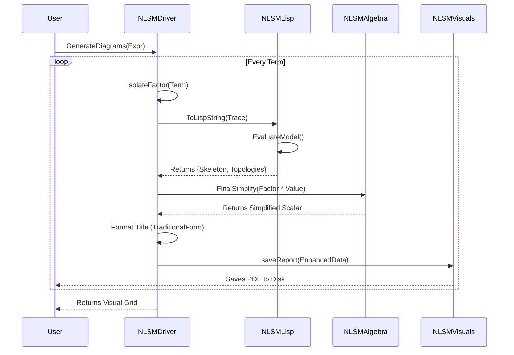

UML Diagram which shows what has been implemented and what is needed.
```mermaid
graph TD
    Master Program([Prototype: User / Notebook])
    Driver[NLSMDriver<br/><i>The Manager</i>]
    Algebra[NLSMAlgebra<br/><i>Math Engine</i>]
    Lisp[NLSMLisp<br/><i>Lisp Interface & Translator</i>]
    Visuals[NLSMVisuals<br/><i>Pure Renderer</i>]
    ExtLisp((External<br/>Lisp Program: Contraction Engine))
    FileSystem[(File System)]

    User -->|1. Calls with full expression| Driver
    
    Driver -->|2. Splits Terms & Sends to LISP| Lisp
    Lisp <-->|CLI| ExtLisp
    
    Driver -->|3. Algebraically Simplifies Results| Algebra
    
    Driver -->|4. Sends Data for Diagrams & Report| Visuals
    Visuals -->|5. Exports PDF| FileSystem
    Visuals -.->|Return Grid| User

    classDef main fill:#f9f,stroke:#333,stroke-width:2px;
    classDef sub fill:#e1f5fe,stroke:#333;
    class Driver main;
    class Algebra,Lisp,Visuals sub;
```
Here is the Execution Flow of the Program::

