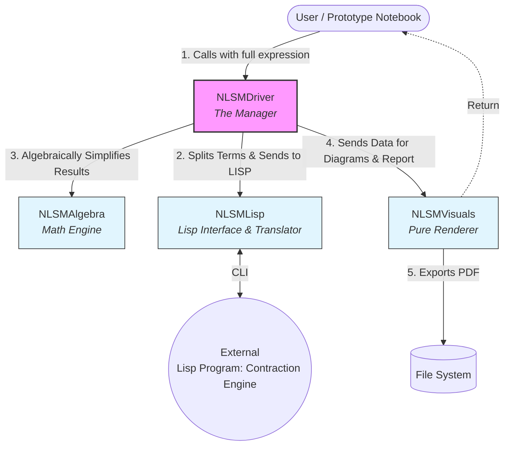
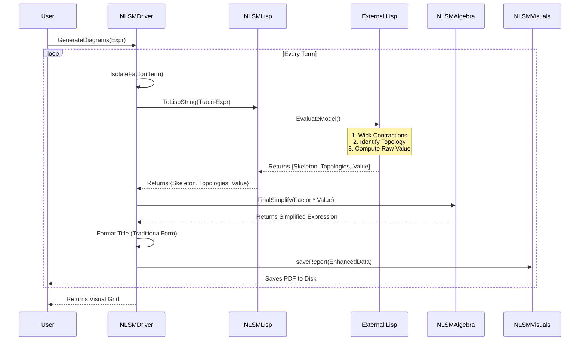

**A sample Mathematica notebook to calculate contractions!**

ClearAll["Global`*"];

SetDirectory[NotebookDirectory[]];

<< NLSMDriver`;

(*2. Define a Dummy Model*)

fullexpr = 
  1/(2 t) Tr[\[CapitalPhi][r] . Subscript[\[Sigma], 3] . W[r] . 
      W[r] . \[CapitalPhi][r] . Subscript[\[Sigma], 3] . W[r] . 
      W[r]] + \[Lambda]/(2 t)
     Tr[\[CapitalPhi][r] . Subscript[\[Sigma], 
      3] . \[CapitalPhi][r] . Subscript[\[Sigma], 3] . W[r] . W[r] . 
      W[r] . W[r]] + (1 + \[Lambda])/(2 t)
     Tr[\[CapitalPhi][r] . Subscript[\[Sigma], 3] . 
      W[r] . \[CapitalPhi][r] . Subscript[\[Sigma], 3] . W[r] . 
      W[r] . W[r]];

(*3. Run the Driver*)

NLSMDriver`GenerateDiagrams[fullexpr, "Report", "S2p", "Display" -> True]

**The model architecture**

**---Module to be implemented---**

**Grand generator module**: This module will generate all interaction terms from a given action, restricted to a specific accuracy (e.g., 2-loop). After generating the full expansion, it will feed the final expression to the Driver. This module will essentially replace the current manual input role of the "User" for a complete automation pipeline.

**Integration module**: An added module between the Visuals and Driver. This will perform the necessary integration and keep the singular term (logarithmic quantum corrections in 2d). These will be fed back to the visuals for generating report.

Here is the current execution flow of the Program-->

